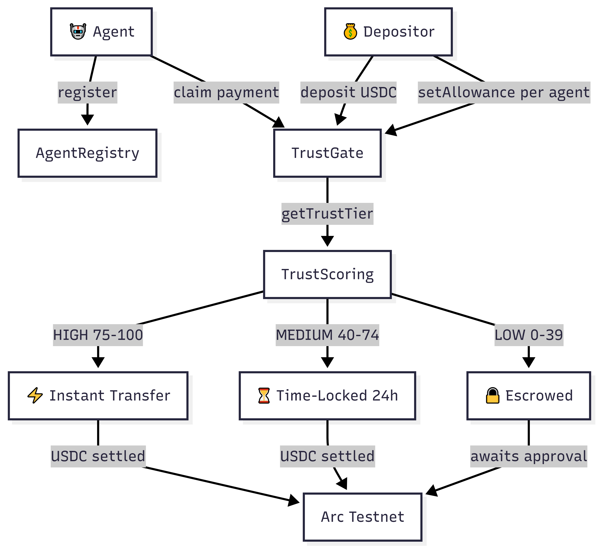

<div align="center">

# TrustGate

**Trust-Gated USDC Payments for the Agentic Economy**

A settlement layer where autonomous agents earn, spend, and get paid in USDC — gated by on-chain reputation, priced per action, and settled through Circle Nanopayments on Arc.

[](https://soliditylang.org/)
[](https://nextjs.org/)
[](https://wagmi.sh/)
[](https://testnet.arcscan.app)
[](LICENSE)

[Problem](#the-problem) &#8226; [How It Works](#how-it-works) &#8226; [Contracts](#deployed-contracts-arc-testnet) &#8226; [Local Setup](#local-setup)

</div>

---

## The Problem

Autonomous agents are now executing economic actions on behalf of humans: fetching data, calling APIs, purchasing compute, paying other agents. Each action has a marginal cost in the range of **$0.0001 to $0.01** — fractions of a cent.

Traditional L1 settlement makes this mathematically impossible:

- A routine USDC transfer on Ethereum mainnet costs **$2 to $20** in gas.
- Paying an agent $0.005 for a completed task costs **400x to 4000x the payment itself**.
- L2s improve this by an order of magnitude, but still leave micropayments uneconomical.
- Off-chain solutions (batching, state channels, custodial ledgers) reintroduce trust assumptions and force every participant into the same platform.

There is no on-chain rail where an agent can be paid per action at its true marginal cost, settled in a stable asset, without a depositor taking on open-ended counterparty risk.

---

## The Solution

TrustGate combines two primitives:

1. **On-chain trust scoring**: every registered agent carries a reputation score (0–100) maintained by authorized oracles. Score buckets map to trust tiers: **HIGH**, **MEDIUM**, **LOW**.
2. **Circle Nanopayments on Arc**: Arc is Circle's purpose-built L1 for USDC settlement, supporting per-transaction costs in the sub-cent range. USDC is native, gas is negligible, and finality is fast.

The combination produces a system where:

- **Depositors** fund an allowance for a specific agent without losing custody.
- **Agents** claim against the allowance per action completed.
- **Trust tier decides the release model** — high-reputation agents settle instantly; medium agents wait through a short time-lock; low or new agents flow through depositor-gated escrow.
- **Per-action pricing stays under $0.01**, making high-frequency agentic work economically viable for the first time.

Trust is the missing primitive. Without it, every depositor must either over-trust (pay instantly and hope) or over-gate (micro-manage every call). TrustGate turns reputation into a routing signal so depositors delegate with the right amount of friction automatically.

---

## How It Works



### Step by step

1. **Agent registers.** Any address can call `AgentRegistry.registerAgent(metadata)` — registration is permissionless. The agent is now discoverable and score-eligible.
2. **Oracle assigns trust score.** An authorized oracle submits a 0–100 score to `TrustScoring`. Score ranges map to tiers: HIGH (75–100), MEDIUM (40–74), LOW (0–39). Unscored agents default to LOW.
3. **Depositor deposits USDC.** The depositor approves USDC and calls `TrustGate.deposit(amount)`. Funds sit in a per-depositor balance, still under their control.
4. **Depositor sets per-agent allowance.** `setAllowance(agent, cap, perActionLimit)` authorizes a specific agent to pull up to `cap` in total, with each claim capped at `perActionLimit` (typically ≤ $0.01).
5. **Agent claims.** The agent calls `TrustGate.claim(depositor, amount)`. TrustGate reads the agent's tier from `TrustScoring` and routes the claim:
   - **HIGH** — USDC transfers instantly to the agent.
   - **MEDIUM** — claim enters a short time-lock; agent calls `releaseDelayed(claimId)` after the lock expires.
   - **LOW** — claim enters escrow; the depositor must explicitly call `approveEscrow(claimId)` for release.
6. **USDC settles on Arc.** Transfer cost is in the sub-cent range thanks to Arc's nanopayment economics. The depositor can cancel any pending (non-released) claim to recover the funds.

The routing is enforced on-chain. Depositors don't pick tiers — the agent's reputation decides.

---

## Key Features

- **Trust-gated payments** — three-tier reputation gating built into the settlement contract. Agents graduate from escrow to time-lock to instant as they build score.
- **3-tier routing** — HIGH (instant), MEDIUM (time-locked), LOW (depositor-approved escrow). Deterministic, on-chain, no off-chain arbiters.
- **Per-action pricing ≤ $0.01** — depositors enforce micro-limits per claim, making agentic workflows viable without blowing through allowances.
- **99.97% cost reduction vs L1 gas** — a $0.005 agent payment on Ethereum mainnet costs multiples of its value in gas; on Arc, the same settlement costs a fraction of a cent.
- **Permissionless agent registration** — any address can register and earn score. No gatekeeper. No allowlist.
- **Depositor-safe** — allowances are revocable, pending claims are cancellable, escrow releases require explicit approval. Funds never leave the depositor's control without tier-appropriate gating.
- **Oracle-pluggable scoring** — `TrustScoring` is oracle-authorized; reputation sources (EigenTrust, custom models, external signals) can be swapped without touching settlement logic.

---

## Tech Stack

| Layer | Technology | Purpose |
|:------|:-----------|:--------|
| Settlement chain | Arc Testnet (chain id `5042002`) | Purpose-built USDC L1, nanopayment economics |
| Stable asset | USDC (6 decimals, native on Arc) | Unit of account for all agent payments |
| Contracts | Solidity `0.8.27`, Hardhat `2.22` | Agent registry, trust scoring, trust-gated allowance |
| Libraries | OpenZeppelin Contracts `^5.1` | Ownable2Step, ReentrancyGuard, ERC20 interfaces |
| Verification | `@nomicfoundation/hardhat-verify` | Arcscan contract verification |
| Frontend | Next.js 14 (App Router), React 18, TypeScript 5 | Depositor / agent / claims dashboard |
| Web3 client | wagmi v2, viem v2, ConnectKit | Typed hooks, RPC, wallet UX |
| State | `@tanstack/react-query` | Contract read caching and background updates |
| Styling | Tailwind CSS 3, Framer Motion 12 | Dark-first design, motion primitives |
| Fonts | Syne (display), Plus Jakarta Sans (body), JetBrains Mono | Editorial typography, precision dark |
| Icons | lucide-react | Line-weight icon set |

Test suite: **142 passing** (Hardhat + Chai), covering agent lifecycle, deposit/withdraw, per-tier claim flows, cancellation, escrow approval, and cross-contract integration.

---

## Deployed Contracts (Arc Testnet)

> Chain id: `5042002` &#8226; RPC: `https://rpc.testnet.arc.network` &#8226; Explorer: [testnet.arcscan.app](https://testnet.arcscan.app)

| Contract | Address | Arcscan |
|:---------|:--------|:--------|
| **TrustScoringPlaintext** | `0xEb979Dc25396ba4be6cEA41EAfEa894C55772246` | [View](https://testnet.arcscan.app/address/0xEb979Dc25396ba4be6cEA41EAfEa894C55772246) |
| **AgentRegistry** | `0x73d3cf7f2734C334927f991fe87D06d595d398b4` | [View](https://testnet.arcscan.app/address/0x73d3cf7f2734C334927f991fe87D06d595d398b4) |
| **TrustGate** | `0x52E17bC482d00776d73811680CbA9914e83E33CC` | [View](https://testnet.arcscan.app/address/0x52E17bC482d00776d73811680CbA9914e83E33CC) |
| USDC (reference) | `0x3600000000000000000000000000000000000000` | [View](https://testnet.arcscan.app/address/0x3600000000000000000000000000000000000000) |

Deployed 2026-04-17. All three TrustGate contracts are wired together on-chain: `TrustGate` reads tiers from `TrustScoringPlaintext` and agent status from `AgentRegistry`.

---

## Local Setup

### Prerequisites

- Node.js `>= 18`
- A funded Arc Testnet key (for deployment)
- An EVM wallet (MetaMask, Rabby, or any ConnectKit-supported wallet)

### 1. Clone and install

```bash
git clone https://github.com/rudazy/TrustGate.git
cd TrustGate

# Install contract workspace
npm install

# Install frontend workspace
cd frontend
npm install
cd ..
```

### 2. Configure environment

```bash
cp .env.example .env
```

Edit `.env` and populate:

```dotenv
PRIVATE_KEY=0x...                               # deployer key (Arc Testnet funded)
ARC_TESTNET_RPC_URL=https://rpc.testnet.arc.network
ETHERSCAN_API_KEY=any-nonempty-string           # Arcscan accepts any non-empty key
```

### 3. Compile and test

```bash
npx hardhat compile
npx hardhat test
```

### 4. Deploy to Arc Testnet

```bash
npx hardhat run scripts/deploy-arc.ts --network arcTestnet
```

The script deploys `TrustScoringPlaintext`, `AgentRegistry`, and `TrustGate`, wires them together, and writes addresses to `deployments/arcTestnet-addresses.json`.

### 5. Verify on Arcscan (optional)

```bash
npx hardhat verify --network arcTestnet <ADDRESS> <CONSTRUCTOR_ARGS...>
```

If the first attempt returns a generic "Unable to verify" error, retry with `--force` — Arcscan's verify endpoint accepts any non-empty `ETHERSCAN_API_KEY` but occasionally needs a second pass.

### 6. Run the frontend

```bash
cd frontend
npm run dev
```

Open [http://localhost:3000](http://localhost:3000), connect a wallet, and switch to Arc Testnet. The dashboard exposes three panels:

- **Depositor** — deposit / withdraw USDC, set per-agent allowances.
- **Agents** — register agents, view trust scores, deactivate.
- **Claims** — file claims, release time-locked claims, approve escrowed claims, cancel pending.

If you need Arc testnet USDC, use the faucet linked in the dashboard footer.

---

## License

MIT — see [LICENSE](LICENSE).
